# 🏗️ End-to-End Infrastructure Automation Pipeline

> This project was built from scratch and deployed on AWS using Terraform, GitHub Actions, Ansible, and Docker as part of hands-on DevOps learning and automation practice.

> **Terraform · Ansible · GitHub Actions · AWS · Docker**

[](https://www.terraform.io/)
[](https://www.ansible.com/)
[](https://github.com/features/actions)
[](https://aws.amazon.com/)
[](https://www.docker.com/)

An end-to-end Infrastructure-as-Code project that provisions AWS cloud infrastructure with Terraform, manages centralized remote state via S3, and automatically configures and deploys a containerized application via Ansible through GitHub Actions.

---

## 📋 Project Overview

This project demonstrates a complete Infrastructure CI/CD pipeline where:

- **Terraform** provisions all AWS resources from code — no manual console clicks
- **S3 Remote Backend** centralizes Terraform state for reproducible, team-safe deployments
- **GitHub Actions** orchestrates the entire workflow automatically on every push
- **Ansible** handles all EC2 server configuration and application deployment
- **Docker Compose** runs the multi-service application in containers

The result is a fully automated, repeatable infrastructure that can be destroyed and recreated from scratch with a single pipeline run.

---

## 📌 Project Highlights

- Automated AWS Infrastructure Provisioning using Terraform
- S3 Remote Backend Configuration
- GitHub Actions CI/CD Pipeline
- Dynamic Ansible Deployment
- Dockerized Application Deployment
- Elastic IP Integration
- Fully Automated End-to-End Workflow
- Infrastructure Provisioning to Live Application in ~2 Minutes

---

## 🔗 Repositories

### Infrastructure Automation Repository
[Terraform & Ansible Infrastructure Automation Project](https://github.com/au422621106016/Terraform-and-Ansible-infrastructure-automation-project)

### Application Repository
[DevOps Task Platform](https://github.com/au422621106016/devops-task-platform)

---

## 🚀 Deployment Workflow

```
Git Push
    ↓
GitHub Actions (workflow trigger)
    ↓
Terraform Init → Terraform Validate → Terraform Plan → Terraform Apply
    ↓
AWS Infrastructure Provisioned
(VPC · Subnet · IGW · Route Table · Security Group · EC2 · Elastic IP)
    ↓
Ansible Inventory Updated (with EC2 Elastic IP)
    ↓
Ansible Playbook Execution
(Docker install · Repo clone · Env config · Docker Compose up)
    ↓
Application Live on EC2
```

Every step is automated. No manual provisioning or server configuration required after pipeline execution.

---

## 🌐 Live Deployment

Application accessible through the Terraform-provisioned Elastic IP.

> Note: Infrastructure may be destroyed when not in use to avoid AWS costs.

---

## 🏛️ Architecture

```
┌─────────────────────────────────────────────────────────────┐
│                        GitHub                               │
│  ┌──────────────┐    ┌───────────────────────────────────┐  │
│  │  Source Code  │───▶│         GitHub Actions            │  │
│  │  + Terraform  │    │  terraform init → validate →      │  │
│  │  + Ansible    │    │  plan → apply → ansible-playbook  │  │
│  └──────────────┘    └───────────────┬───────────────────┘  │
└──────────────────────────────────────│──────────────────────┘
                                       │
                    ┌──────────────────▼──────────────────────┐
                    │                AWS                       │
                    │  ┌──────────────────────────────────┐   │
                    │  │              VPC                  │   │
                    │  │  ┌────────────────────────────┐  │   │
                    │  │  │       Public Subnet         │  │   │
                    │  │  │  ┌──────────────────────┐  │  │   │
                    │  │  │  │   EC2 Instance        │  │  │   │
                    │  │  │  │   + Elastic IP        │  │  │   │
                    │  │  │  │   + Security Group    │  │  │   │
                    │  │  │  │  ┌─────────────────┐  │  │  │   │
                    │  │  │  │  │  Docker Compose  │  │  │  │   │
                    │  │  │  │  │  Application     │  │  │  │   │
                    │  │  │  │  └─────────────────┘  │  │  │   │
                    │  │  │  └──────────────────────┘  │  │   │
                    │  │  └────────────────────────────┘  │   │
                    │  └────────────────┬─────────────────┘   │
                    │  ┌────────────────▼─────────────────┐   │
                    │  │     S3 Bucket (Remote Backend)    │   │
                    │  │     terraform.tfstate             │   │
                    │  │     + Locking Enabled              │   │
                    │  └──────────────────────────────────┘   │
                    └─────────────────────────────────────────┘
```

---

## ✅ Features

| Feature | Description |
|---|---|
| **Infrastructure as Code** | 100% of AWS resources defined in Terraform — no manual provisioning |
| **Remote State Management** | Terraform state stored in Amazon S3 with remote backend configuration |
| **GitHub Actions CI/CD** | Full pipeline triggered on `git push` — Terraform through Docker deployment |
| **Idempotent Configuration** | Ansible playbooks are idempotent — safe to re-run without side effects |
| **Elastic IP Reuse** | Elastic IP persists across infrastructure recreations — no DNS changes needed |
| **Reproducible Deployments** | Entire stack can be destroyed and recreated from code in minutes |
| **Containerized Application** | Application runs in Docker Compose — portable and environment-consistent |

---

## 🛠️ Technologies Used

| Layer | Technology | Purpose |
|---|---|---|
| Cloud Provider | AWS | EC2, VPC, S3, IAM |
| Infrastructure as Code | Terraform | AWS resource provisioning |
| Remote State | Amazon S3 | Centralized remote backend configuration |
| CI/CD Orchestration | GitHub Actions | Automated pipeline trigger |
| Configuration Management | Ansible | EC2 setup and app deployment |
| Containerization | Docker + Docker Compose | Application runtime |
| OS | Ubuntu (EC2) | Server operating system |

---

## 📁 Project Structure

```
.
├── terraform/
│   ├── main.tf               # VPC, Subnet, IGW, Route Table, Security Group
│   ├── ec2.tf                # EC2 instance + Elastic IP
│   ├── backend.tf            # S3 Remote Backend configuration
│   ├── variables.tf          # Input variables
│   └── outputs.tf            # EC2 public IP output
│
├── ansible/
│   ├── playbook.yml          # Main playbook: Docker install, repo clone, deploy
│   └── inventory/
│       └── hosts.ini         # EC2 Elastic IP target (updated by pipeline)
│
├── .github/
│   └── workflows/
│       └── infra.yml         # GitHub Actions workflow definition
│
└── README.md
```

---

## ⚙️ GitHub Actions CI/CD Pipeline

The pipeline in `.github/workflows/infra.yml` runs these stages in sequence:

```yaml
stages:
  1. Checkout repository
  2. Configure AWS credentials (from GitHub Secrets)
  3. terraform init      # Initialize with S3 remote backend
  4. terraform validate  # Validate configuration syntax
  5. terraform plan      # Preview infrastructure changes
  6. terraform apply     # Provision/update AWS infrastructure
  7. Install Ansible on runner
  8. Update Ansible inventory with EC2 Elastic IP
  9. Run ansible-playbook to configure EC2 and deploy application
```

**Required GitHub Secrets:**
```
AWS_ACCESS_KEY_ID
AWS_SECRET_ACCESS_KEY
EC2_HOST
EC2_SSH_KEY
```

---

## ☁️ Terraform — AWS Infrastructure

Resources provisioned by Terraform:

```hcl
# Networking
aws_vpc                    → Isolated network (10.0.0.0/16)
aws_subnet                 → Public subnet (10.0.1.0/24)
aws_internet_gateway       → Internet access for public subnet
aws_route_table            → Route 0.0.0.0/0 → IGW
aws_route_table_association → Associates subnet with route table

# Compute & Security
aws_security_group         → Inbound: SSH (22), HTTP (80); Outbound: all
aws_instance               → Ubuntu EC2 (t3.small)
aws_eip                    → Static Elastic IP for stable addressing

# State Management
S3 Remote Backend          → Stores terraform.tfstate centrally
Terraform State Locking Enabled (use_lockfile = true)
```

---

## ⚙️ Ansible — Configuration Management

The Ansible playbook automates all EC2 setup tasks:

```yaml
tasks:
  - Install required dependencies
  - Install Docker using official script
  - Enable and start Docker service
  - Add ubuntu user to docker group
  - Restart Docker service
  - Clone application repository from GitHub
  - Create .env file
  - Run Docker containers (docker-compose up)
```

Elastic IP reuse ensures the Ansible inventory remains valid across infrastructure recreations — no manual IP updates needed.

---

## 📸 Pipeline Walkthrough — Screenshots

## 📸 Screenshot Index

1. S3 Bucket Creation
2. DynamoDB Lock Table
3. Backend Configuration
4. Terraform Backend Migration
5. Terraform Initialization
6. Terraform Apply
7. EC2 Provisioning
8. Remote State Verification
9. GitHub Actions Workflow
10. Pipeline Execution
11. Ansible Deployment
12. Live Application

---

> Every screenshot below was captured during a real end-to-end infrastructure provisioning and deployment workflow.

---

### 🗄️ Step 1 — S3 Remote Backend Setup

**S3 Bucket Created**

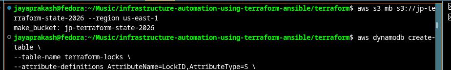

The S3 bucket `jp-terraform-state-2026` was created in `us-east-1` to serve as the centralized Terraform remote backend. All `terraform.tfstate` files are stored here instead of locally, enabling team-safe, conflict-free infrastructure management.

---

**DynamoDB Lock Table Created**

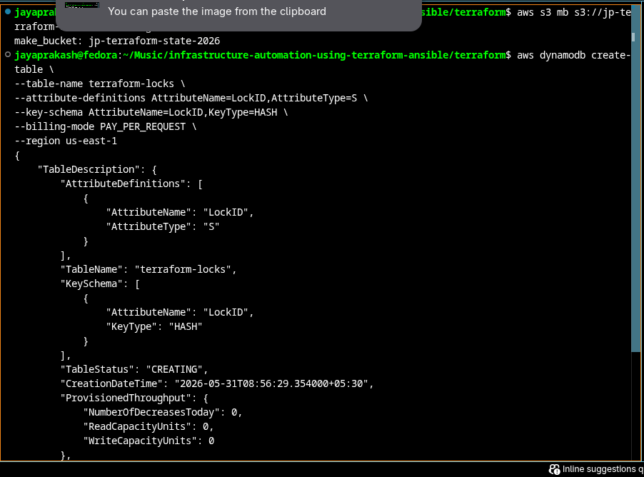

A DynamoDB table `terraform-locks` was created with a `LockID` hash key to provide state locking. This prevents two pipeline runs from applying Terraform changes simultaneously and corrupting the state file.

---

### 📄 Step 2 — Backend Configuration

**backend.tf — S3 Backend Config**

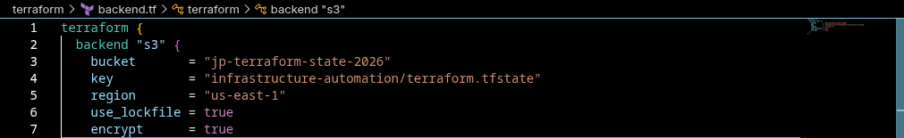

The `backend.tf` file configures Terraform to use the S3 bucket as remote state storage with `use_lockfile = true` and `encrypt = true`. This replaces the default local `terraform.tfstate` with a centralized, encrypted, locked state file in S3.

---

**Terraform Init — Backend Migrated to S3**

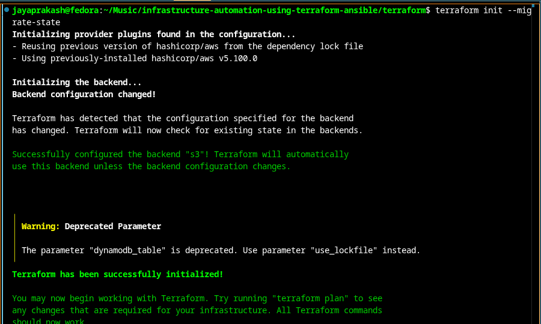

Running `terraform init --migrate-state` detects the new S3 backend configuration and successfully migrates the existing local state to the remote S3 bucket. The output confirms: *"Successfully configured the backend s3!"*

---

**Terraform Init — Successfully Initialized**

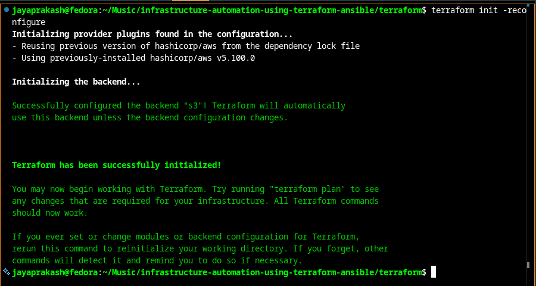

After backend migration, `terraform init -reconfigure` confirms the S3 backend is active and Terraform is fully initialized, ready for plan and apply operations against the remote state.

---

### ☁️ Step 3 — Terraform Apply — AWS Infrastructure Provisioned

**Terraform Apply — Resources Creating**

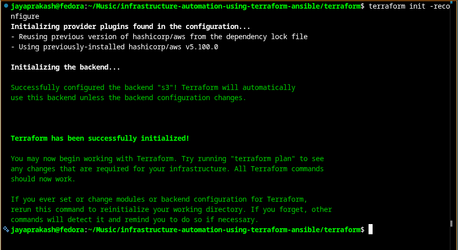

`terraform apply` provisions all 9 AWS resources in sequence: VPC, Key Pair, Internet Gateway, Route Table, Security Group, Public Subnet, Route Table Association, EC2 Instance, and Elastic IP Association. Each resource creation is confirmed with its AWS resource ID.

---

**Terraform Apply — Complete (9 Resources Added)**

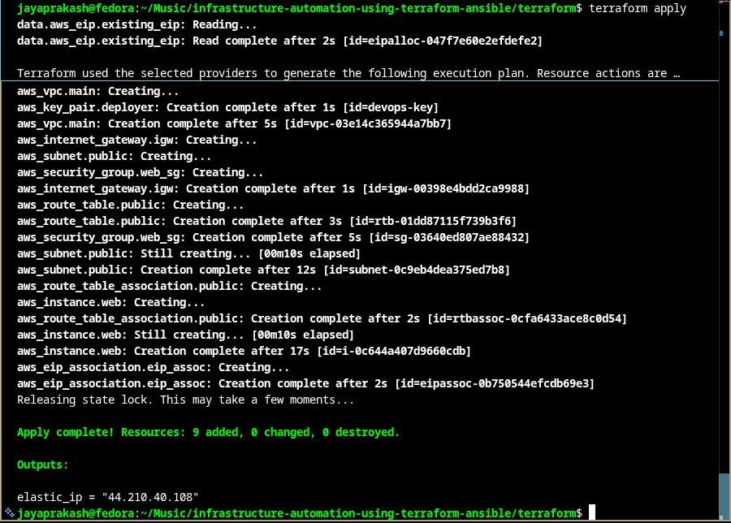

Apply completes successfully: **9 resources added, 0 changed, 0 destroyed**. The state lock is released automatically. The EC2 Elastic IP is printed as output — this address is stable across all future infrastructure recreations.

---

**EC2 Instance Running — AWS Console**

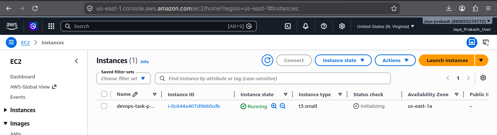

The EC2 instance `devops-task-p...` (t3.small) appears in the AWS Console with **Running** state immediately after `terraform apply`. This instance was provisioned entirely from code — no manual console interaction.

---

### 🗂️ Step 4 — Remote State Verified in S3

**Terraform State List + S3 State File Confirmed**

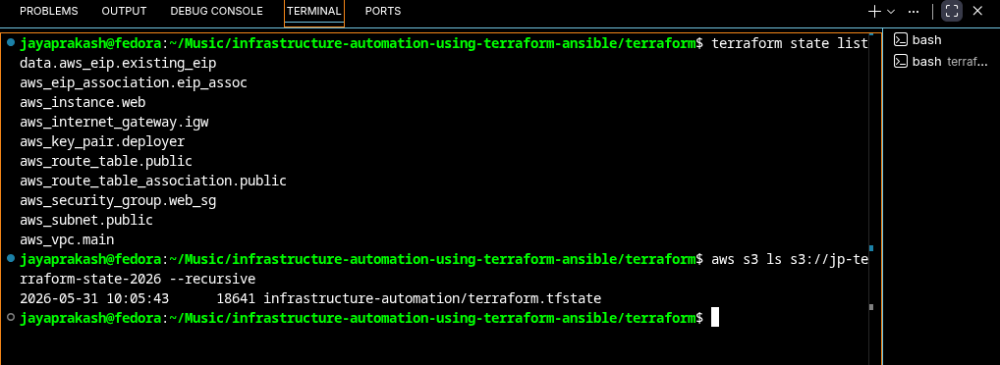

`terraform state list` shows all 9 managed resources tracked in the remote state. `aws s3 ls` confirms the `terraform.tfstate` file (18,641 bytes) is stored in the S3 bucket at `infrastructure-automation/terraform.tfstate` — no local state file dependency.

---

### 🔄 Step 5 — GitHub Actions Workflow

**Workflow File — Part 1 (Checkout, AWS, Terraform)**

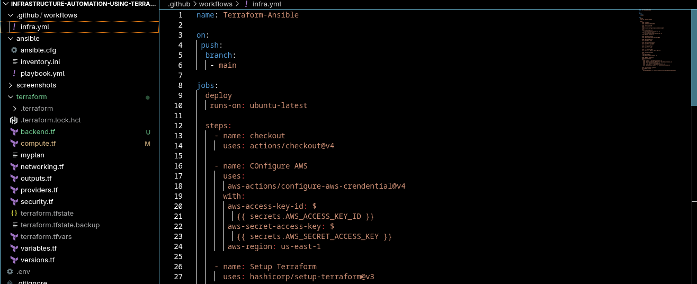

The `infra.yml` workflow file triggers on every push to `main`. It configures AWS credentials from GitHub Secrets, sets up Terraform, and runs `terraform init`, `validate`, `plan`, and `apply --auto-approve` — fully automated, no manual approvals required.

---

**Workflow File — Part 2 (Ansible Inventory + Playbook)**

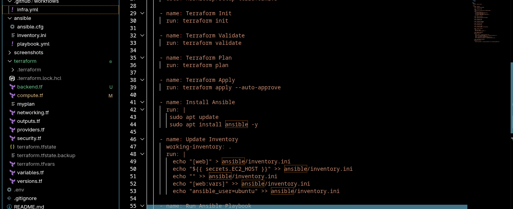

After Terraform apply, the pipeline installs Ansible on the runner, dynamically injects the EC2 Elastic IP into `ansible/inventory.ini` from `secrets.EC2_HOST`, then executes the playbook with `ansible-playbook -i ansible/inventory.ini ansible/playbook.yml`.

---

### 🚀 Step 6 — Pipeline Triggered by Git Push

**Git Commit + Push → Pipeline Trigger**

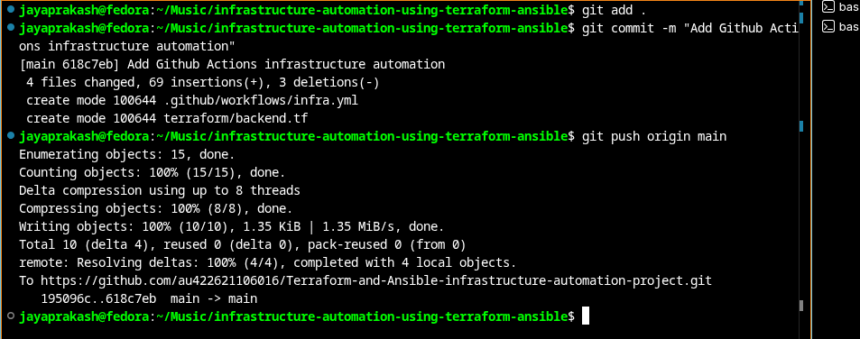

A single `git push origin main` triggers the entire pipeline. The commit adds the GitHub Actions workflow (`infra.yml`) and S3 backend configuration (`backend.tf`) — 4 files changed, 69 insertions. The push is confirmed to the remote repository on GitHub.

---

### ✅ Step 7 — GitHub Actions Pipeline — Success

**Pipeline Run — Status: Success**

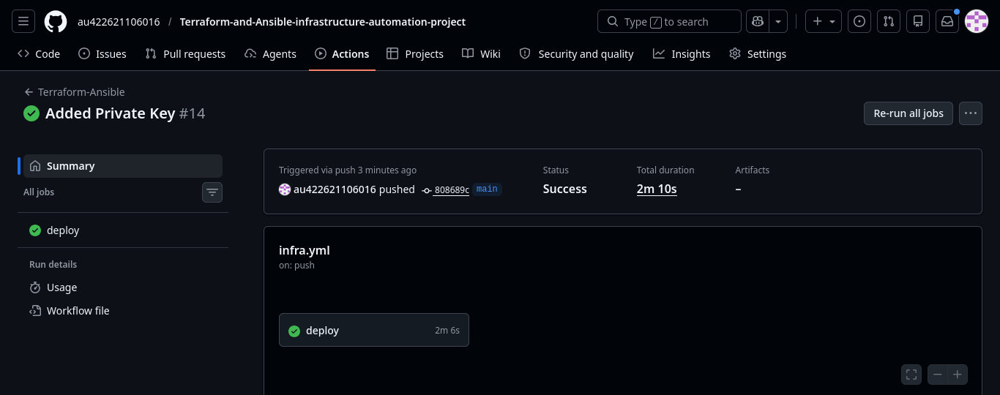

The GitHub Actions pipeline run `#14` completes with **Status: Success** in **2 minutes 10 seconds**. The `deploy` job ran for 2m 6s covering all stages: Terraform provisioning through Ansible deployment. Triggered automatically by the `git push` on `main`.

---

### 🖥️ Step 8 — EC2 Instance — 3/3 Health Checks Passed

**EC2 3/3 Checks Passed**

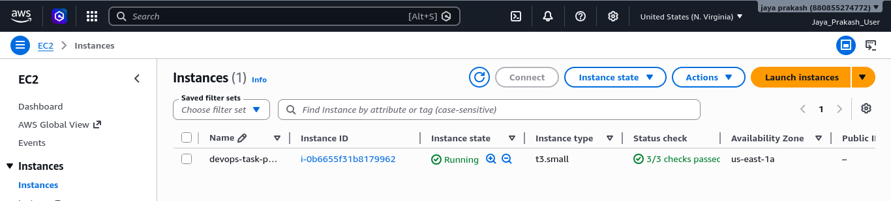

After the pipeline completes, the AWS EC2 console confirms the instance has passed all **3/3 health checks** with **Running** status. This instance was provisioned by Terraform and fully configured by Ansible without any manual SSH or console access.

---

### ⚙️ Step 9 — Ansible Playbook Execution Logs

**Ansible Playbook — All Tasks Completed**

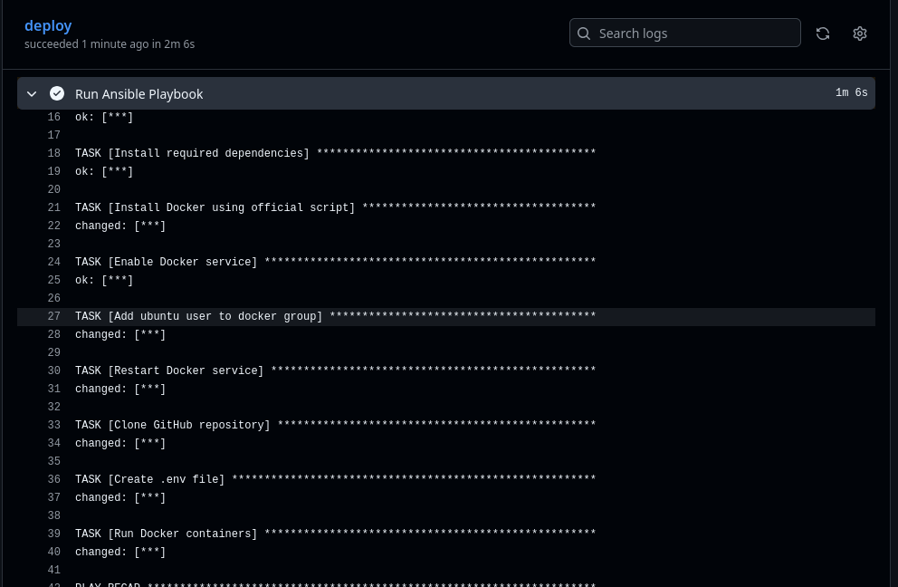

The GitHub Actions logs show the Ansible playbook execution in real-time. All tasks complete successfully:
- ✅ Install required dependencies
- ✅ Install Docker using official script (`changed`)
- ✅ Enable Docker service
- ✅ Add ubuntu user to docker group (`changed`)
- ✅ Restart Docker service (`changed`)
- ✅ Clone GitHub repository (`changed`)
- ✅ Create .env file (`changed`)
- ✅ Run Docker containers (`changed`)

---

### 🌐 Step 10 — Application Live

**DevOps Task Platform — Application Deployed**

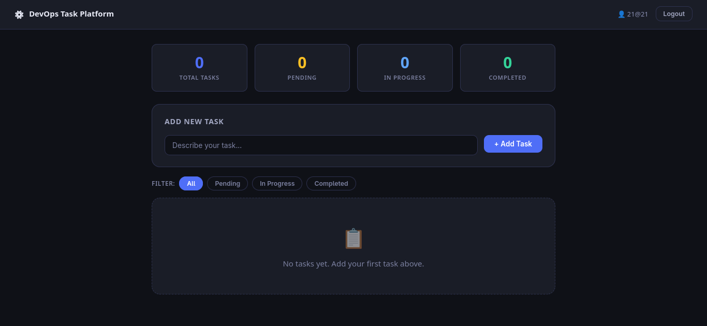

The **DevOps Task Platform** is live and accessible at the Terraform-provisioned Elastic IP. The application loads successfully in the browser, deployed entirely through the automated pipeline without any manual SSH or deployment steps.

---

**Application Working — Tasks Added and Managed**

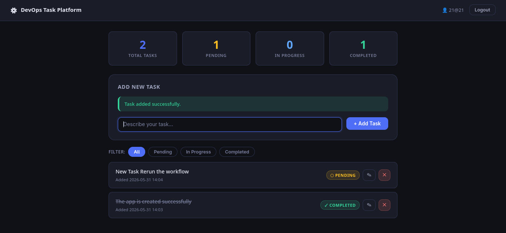

The application is fully functional: tasks can be created, filtered, and managed with Pending/In Progress/Completed status tracking. This confirms the entire stack — Terraform → AWS → Ansible → Docker Compose → Application — works end-to-end.

---

## 🧩 Key Engineering Decisions

**Why Terraform Remote Backend?**
Local state files are fragile — they break if the runner changes, get lost, or cause conflicts in teams. S3 Remote Backend with state locking makes the pipeline stateful and safe across runs.

**Why Elastic IP?**
EC2 instances get new public IPs on every stop/start. Elastic IP allocates a static address that survives infrastructure recreation, keeping DNS and Ansible inventory stable.

**Why Separate Terraform + Ansible?**
Terraform handles infrastructure provisioning (what exists); Ansible handles configuration management (what's installed/running). This separation of concerns keeps each layer focused and maintainable.

**Why GitHub Actions?**
GitHub Actions integrates natively with the repository, requires no separate CI server, and securely manages AWS credentials via encrypted secrets — ideal for infrastructure pipelines.

---

## 🎓 Key Learnings

- **Infrastructure CI/CD** — automating Terraform through a GitHub Actions pipeline, not just running it locally
- **Remote State Management** — the importance of S3 backend and state locking for reproducible, conflict-free deployments
- **Separation of Concerns** — Terraform for provisioning, Ansible for configuration, Docker for runtime
- **Idempotency** — designing Ansible playbooks that are safe to re-run at any point in the pipeline
- **Elastic IP Strategy** — keeping addresses stable across destroy/recreate cycles without DNS changes
- **End-to-end thinking** — designing a workflow where a single `git push` delivers a live application

---

## 📈 Project Outcomes

- Reduced manual deployment steps to zero
- Automated infrastructure provisioning and application deployment
- Enabled reproducible environment creation through Infrastructure as Code
- Centralized Terraform state management using S3 backend
- Implemented configuration management using Ansible
- Deployed containerized application through GitHub Actions CI/CD

---

## 🗺️ Future Roadmap

- [ ] Add Terraform modules for reusable VPC and EC2 components
- [ ] Integrate Terraform workspaces for dev/staging/prod environments
- [ ] Add Prometheus + Grafana monitoring stack to Ansible playbook
- [ ] Migrate to AWS EKS (Kubernetes) for container orchestration
- [ ] Implement Terraform `terraform plan` PR checks with policy gating

---

## 👤 Author

**Jaya Prakash S** — Aspiring DevOps Engineer | AWS | Terraform | Ansible | GitHub Actions | Docker

[](https://linkedin.com/in/jaya-prakash-s-1ba6442bb)
[](https://github.com/au422621106016)
[](mailto:jayasmasher1993@gmail.com)
