# 🚀 Automated Infrastructure Provisioning and Application Deployment using Terraform & Ansible

> **End-to-end DevOps automation** — from zero to a live application running on AWS, with infrastructure provisioned by Terraform and application deployment orchestrated by Ansible.

---

## 📌 Project Overview

This project automates infrastructure provisioning and application deployment using **Terraform** and **Ansible** on AWS. The goal is to build a reproducible DevOps workflow where both infrastructure creation and application deployment are handled automatically — with a manual validation step included to verify the deployment before full Ansible automation.

---

## 🛠️ Prerequisites

Before getting started, ensure the following tools and configuration are in place:

| Requirement | Notes |
|---|---|
| AWS Account | With IAM credentials that have EC2, VPC, and EIP permissions |
| AWS CLI | Configured via `aws configure` with your access key and secret |
| Terraform | v1.5.0 or higher — [Install Guide](https://developer.hashicorp.com/terraform/install) |
| Ansible | v2.12 or higher — `pip install ansible` |
| SSH Key Pair | Generate with `ssh-keygen -t rsa -b 4096 -f ~/.ssh/id_rsa` |
| Git | For cloning the application repository |

---

## 🏗️ Workflow Architecture

```text
Terraform
   ↓
Create AWS Infrastructure
(EC2 · VPC · Subnet · Security Groups · Route Tables)
   ↓
Elastic IP Association
   ↓
SSH Access
   ↓
Manual Docker Deployment Testing  ← (Part 2 Validation)
   ↓
Ansible Automation
   ↓
Docker Install → Git Clone → .env Creation → Docker Compose Up
   ↓
✅ Automated Application Deployment
```

---

## ⚙️ Tech Stack

| Category | Tools |
|---|---|
| Infrastructure as Code | Terraform |
| Configuration Management | Ansible |
| Cloud Provider | AWS (EC2, VPC, Security Groups, Elastic IP) |
| Containerization | Docker, Docker Compose |
| Application Stack | Nginx, Python/Gunicorn Backend, MySQL, React Frontend |
| Version Control | GitHub |
| OS | Ubuntu 24.04 LTS |

---

## 📁 Project Structure

```
infrastructure-automation-using-terraform-ansible/
│
├── terraform/
│   ├── providers.tf
│   ├── versions.tf
│   ├── variables.tf
│   ├── terraform.tfvars
│   ├── networking.tf
│   ├── security.tf
│   ├── compute.tf
│   └── outputs.tf
│
├── ansible/
│   ├── ansible.cfg
│   ├── inventory.ini
│   └── playbook.yml
│
├── screenshots/
│   ├── 01a_Step1_Terraform_Init_Success.png
│   ├── 01b_Step1_Terraform_Apply_Resources_Created.png
│   ├── 01c_Step1_AWS_Console_EC2_Running.png
│   ├── 01d_Step1_AWS_Console_EC2_Instance_Summary.png
│   ├── 02a_Step2_SSH_Into_EC2_Ubuntu.png
│   ├── 02b_Step2_Docker_Containers_All_Started.png
│   ├── 02c_Step2_Docker_PS_Containers_Running.png
│   ├── 02d_Step2_App_Live_Login_Page.png
│   ├── 02e_Step2_App_Dashboard_Verified.png
│   ├── 03a_Step3_Ansible_Ping_Test_Success.png
│   ├── 03b_Step3_Ansible_Playbook_Tasks_Running.png
│   ├── 03c_Step3_Ansible_Playbook_Recap_ok9_changed6.png
│   ├── 03d_Step3_Docker_Containers_Running_Auto_Deployed.png
│   ├── 03e_Step3_App_Live_Ansible_Deployed.png
│   ├── 04a_Step4_Terraform_Destroy_Complete.png
│   ├── 04b_Step4_Terraform_Recreate_Same_ElasticIP.png
│   ├── 04c_Step4_Ansible_Final_Playbook_Recap.png
│   └── 04d_Step4_App_Final_Live_New_EC2_Same_IP.png
│
├── .gitignore
└── devops-task-platform/
```

---

## ☁️ PART 1 — Terraform: Infrastructure Provisioning

### 📌 `versions.tf`
```hcl
terraform {
  required_version = ">= 1.5.0"
  required_providers {
    aws = {
      source  = "hashicorp/aws"
      version = "~> 5.0"
    }
  }
}
```

### 📌 `providers.tf`
```hcl
provider "aws" {
  region = var.aws_region
}
```

### 📌 `variables.tf`
```hcl
variable "aws_region" {
  default = "us-east-1"
}
variable "instance_type" {
  default = "t3.small"
}
variable "key_name" {
  description = "AWS EC2 Key Pair Name"
}
variable "public_key_path" {
  description = "Path to Public SSH Key"
}
```

### 📌 `terraform.tfvars`
```hcl
key_name        = "devops-key"
public_key_path = "~/.ssh/id_rsa.pub"
```

### 🌐 `networking.tf`
```hcl
resource "aws_vpc" "main" {
  cidr_block = "10.0.0.0/16"
  tags = { Name = "devops-vpc" }
}

resource "aws_subnet" "public" {
  vpc_id                  = aws_vpc.main.id
  cidr_block              = "10.0.1.0/24"
  map_public_ip_on_launch = true
  tags = { Name = "public-subnet" }
}

resource "aws_internet_gateway" "igw" {
  vpc_id = aws_vpc.main.id
  tags = { Name = "devops-igw" }
}

resource "aws_route_table" "public" {
  vpc_id = aws_vpc.main.id
  route {
    cidr_block = "0.0.0.0/0"
    gateway_id = aws_internet_gateway.igw.id
  }
  tags = { Name = "public-route-table" }
}

resource "aws_route_table_association" "public" {
  subnet_id      = aws_subnet.public.id
  route_table_id = aws_route_table.public.id
}
```

### 🔐 `security.tf`
```hcl
resource "aws_security_group" "web_sg" {
  name        = "web-security-group"
  description = "Allow SSH, HTTP, and HTTPS"
  vpc_id      = aws_vpc.main.id

  ingress { description = "SSH";   from_port = 22;  to_port = 22;  protocol = "tcp"; cidr_blocks = ["0.0.0.0/0"] }
  ingress { description = "HTTP";  from_port = 80;  to_port = 80;  protocol = "tcp"; cidr_blocks = ["0.0.0.0/0"] }
  ingress { description = "HTTPS"; from_port = 443; to_port = 443; protocol = "tcp"; cidr_blocks = ["0.0.0.0/0"] }
  egress  { from_port = 0; to_port = 0; protocol = "-1"; cidr_blocks = ["0.0.0.0/0"] }

  tags = { Name = "web-security-group" }
}
```

> ⚠️ **Security Note:** SSH is open to `0.0.0.0/0` here for learning purposes only. In a production environment, restrict SSH access to your specific IP address or a VPN CIDR block.

### 🖥️ `compute.tf`
```hcl
resource "aws_key_pair" "deployer" {
  key_name   = var.key_name
  public_key = file(var.public_key_path)
  tags = { Name = "github-actions" }
}

resource "aws_instance" "web" {
  ami                    = "ami-02dd44faa40720bb8"
  instance_type          = var.instance_type
  subnet_id              = aws_subnet.public.id
  vpc_security_group_ids = [aws_security_group.web_sg.id]
  key_name               = aws_key_pair.deployer.key_name

  root_block_device {
    volume_size = 10
    volume_type = "gp3"
  }
  tags = { Name = "devops-task-platform" }
}

resource "aws_eip" "devops_eip" {
  domain = "vpc"
  tags   = { Name = "devops-elastic-ip" }
}

resource "aws_eip_association" "eip_assoc" {
  instance_id   = aws_instance.web.id
  allocation_id = aws_eip.devops_eip.id
}
```

### 📤 `outputs.tf`
```hcl
output "elastic_ip" {
  value = aws_eip.devops_eip.public_ip
}
```

### 🚀 Terraform Commands

> 💰 **AWS Cost Warning:** Running `terraform apply` will provision real AWS resources (EC2, EIP, VPC) that may incur charges. Run `terraform destroy` when you are done testing to avoid unexpected costs.

```bash
# Initialize Terraform
terraform init

# Validate configuration
terraform validate

# Preview infrastructure changes
terraform plan

# Create infrastructure
terraform apply --auto-approve

# Destroy infrastructure
terraform destroy
```

---

## 📸 Part 1 — Screenshots

### Terraform Init — Provider Installed Successfully

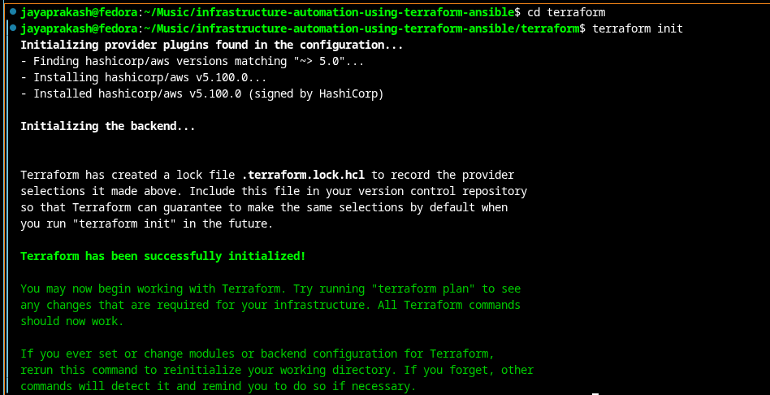

### Terraform Apply — Resources Created (EC2 + Elastic IP)

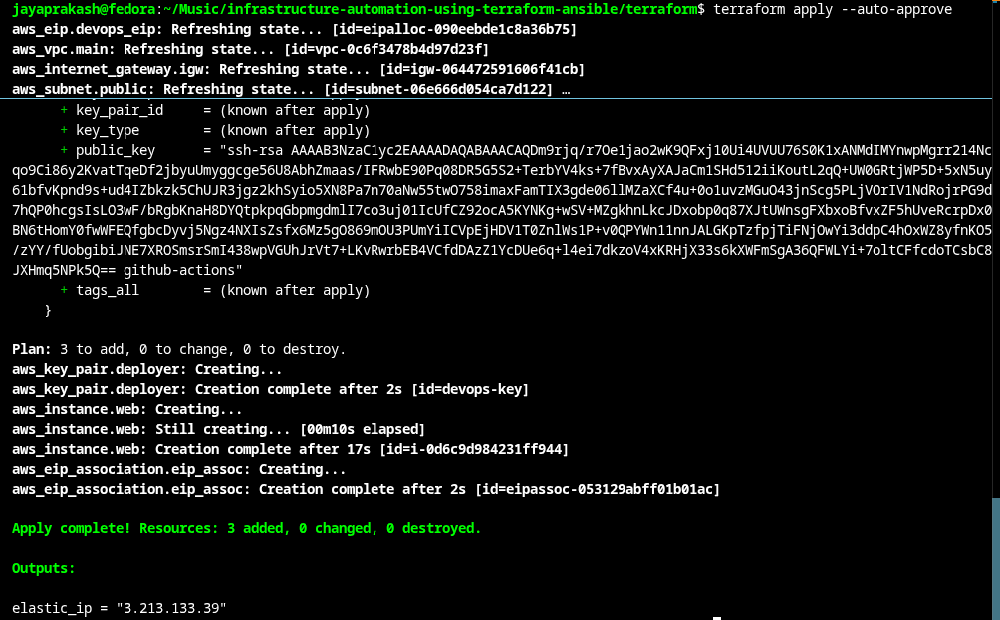

### AWS Console — EC2 Instance Running

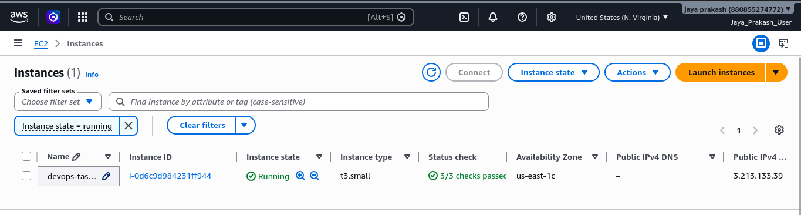

### AWS Console — EC2 Instance Summary (Elastic IP Attached)

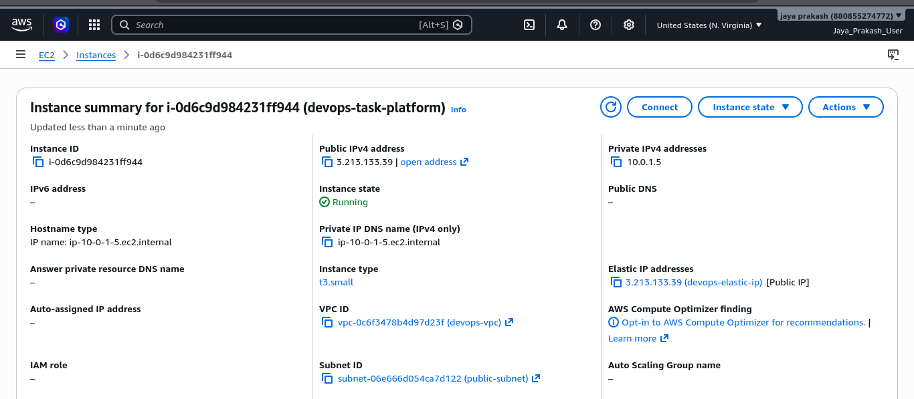

---

## 🐳 PART 2 — Manual Docker Deployment (Validation)

### SSH into EC2

```bash
ssh -i ~/.ssh/id_rsa ubuntu@<ELASTIC_IP>
```

### Install & Enable Docker

```bash
sudo apt update
sudo apt install docker.io -y
sudo systemctl enable docker
sudo systemctl start docker
sudo usermod -aG docker ubuntu
```

### Clone Repository & Configure

```bash
git clone https://github.com/au422621106016/devops-task-platform.git
cd devops-task-platform

# Create environment file
cat > .env <<EOF
MYSQL_ROOT_PASSWORD=rootpassword
MYSQL_DATABASE=taskdb
MYSQL_USER=taskuser
MYSQL_PASSWORD=taskpassword
EOF
```

> ⚠️ **Credential Warning:** The database credentials above are example/demo values for local testing only. In production, use a secrets manager (e.g. AWS Secrets Manager, HashiCorp Vault) and never commit `.env` files to version control.

### Build & Start Containers

```bash
sudo docker compose build --no-cache
sudo docker compose up -d
docker ps
```

---

## 📸 Part 2 — Screenshots

### SSH into EC2 — Ubuntu 24.04 LTS

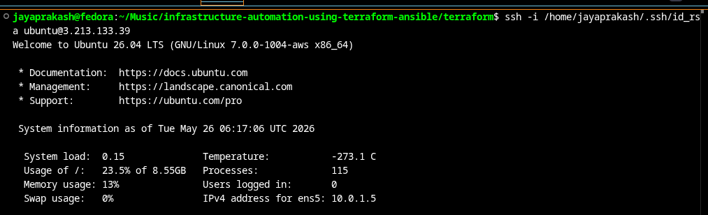

### Docker Compose — All 6 Services Started

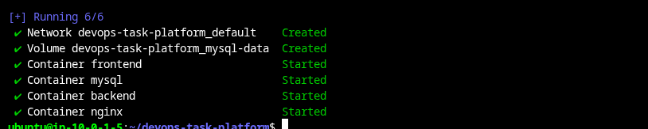

### `docker ps` — All Containers Running

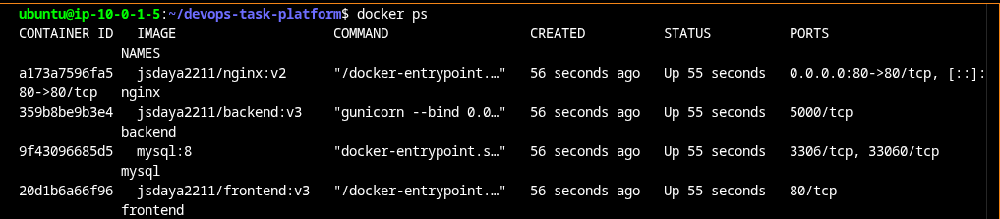

### Application Live — Login Page (Manual Deployment)

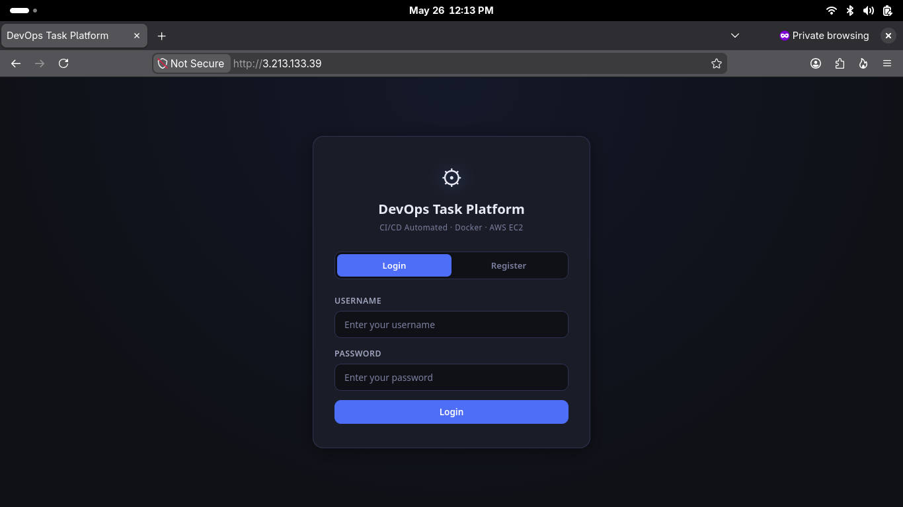

### Application Dashboard — Verified & Functional


---

## 🤖 PART 3 — Ansible Automation

### 📌 `ansible.cfg`
```ini
[defaults]
inventory = inventory.ini
host_key_checking = False
```

### 📌 `inventory.ini`
```ini
[web]
<YOUR_ELASTIC_IP>

[web:vars]
ansible_user=ubuntu
ansible_ssh_private_key_file=~/.ssh/id_rsa
```

### 📌 `playbook.yml`
```yaml
---
- name: Configure EC2 and Deploy Application
  hosts: web
  become: yes

  tasks:
    - name: Install required dependencies
      apt:
        name: [curl, git]
        state: present
        update_cache: yes

    - name: Install Docker using official script
      shell: curl -fsSL https://get.docker.com | sh

    - name: Enable Docker service
      service:
        name: docker
        enabled: yes
        state: started

    - name: Add ubuntu user to docker group
      user:
        name: ubuntu
        groups: docker
        append: yes

    - name: Restart Docker service
      service:
        name: docker
        state: restarted

    - name: Clone GitHub repository
      git:
        repo: "https://github.com/au422621106016/devops-task-platform.git"
        dest: /home/ubuntu/devops-task-platform
        force: yes

    - name: Create .env file
      copy:
        dest: /home/ubuntu/devops-task-platform/.env
        content: |
          MYSQL_ROOT_PASSWORD=rootpassword
          MYSQL_DATABASE=taskdb
          MYSQL_USER=taskuser
          MYSQL_PASSWORD=taskpassword

    - name: Run Docker containers
      shell: docker compose up -d
      args:
        chdir: /home/ubuntu/devops-task-platform
```

### ▶️ Run Ansible

```bash
# Test connectivity
ansible web -m ping

# Dry run (check mode)
ansible-playbook playbook.yml --check

# Execute playbook
ansible-playbook playbook.yml
```

---

## 📸 Part 3 — Screenshots

### Ansible Ping Test — Host Reachable

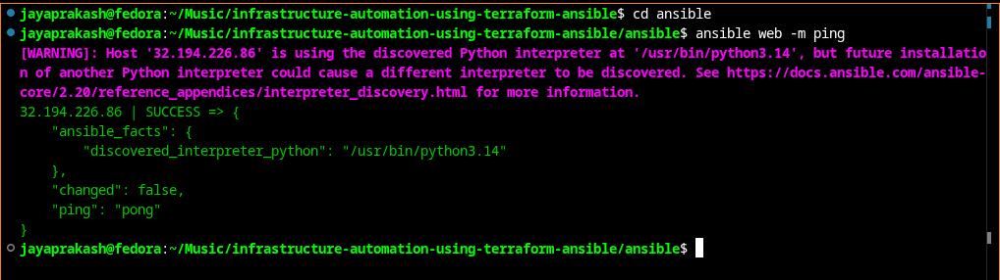

### Ansible Playbook — Tasks Executing

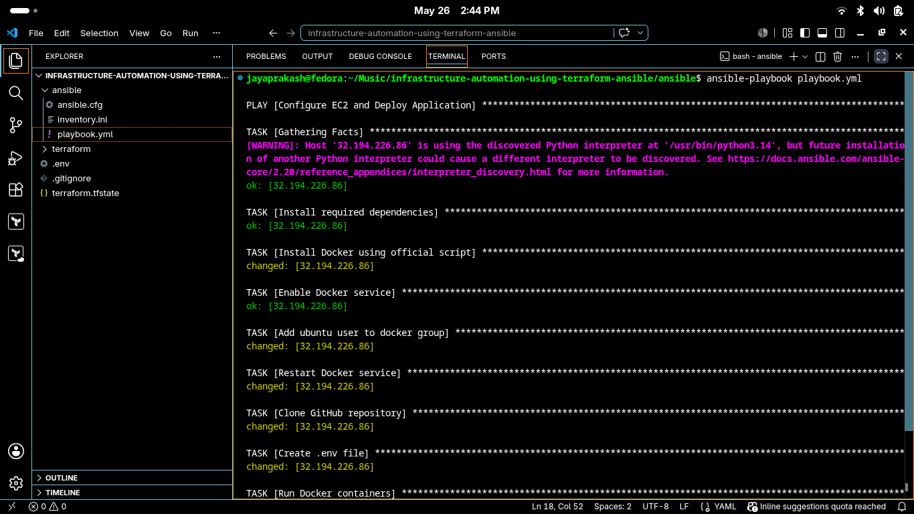

### Ansible Playbook Recap — `ok=9 changed=6` (Zero Failures)

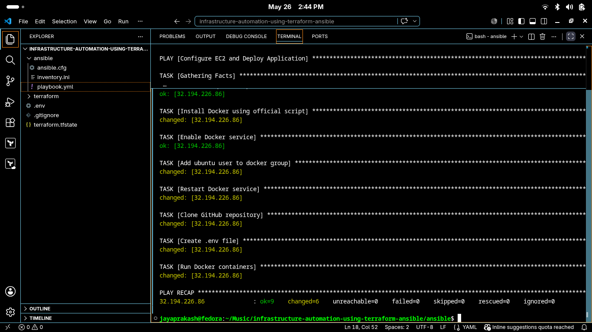

### Docker Containers Running — Ansible Auto-Deployed

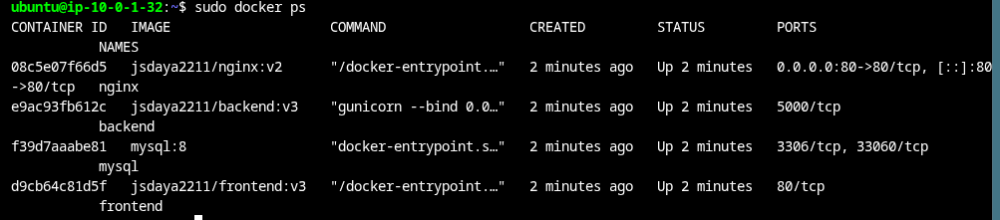

### Application Live — Deployed via Ansible

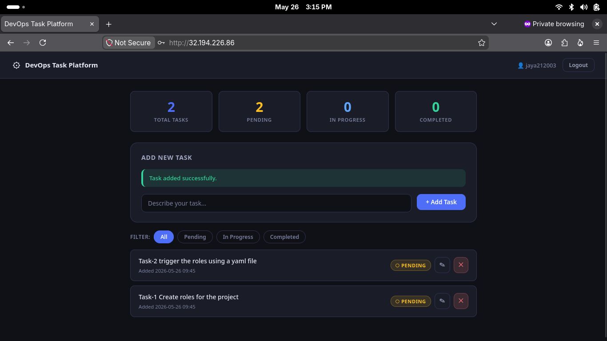

---

## 🔄 PART 4 — Destroy & Recreate (Elastic IP Reusability Proof)

This section demonstrates the key production benefit of Elastic IPs: destroying and recreating the entire infrastructure while retaining the **same public IP address** — meaning Ansible inventory and any DNS records require zero updates.

```bash
# Step 1: Destroy all infrastructure
terraform destroy --auto-approve

# Step 2: Recreate — Elastic IP is re-attached automatically
terraform apply --auto-approve

# Step 3: Run Ansible on the new EC2 (same IP, no config changes)
ansible-playbook playbook.yml
```

---

## 📸 Part 4 — Screenshots

### Terraform Destroy — All Resources Cleaned Up

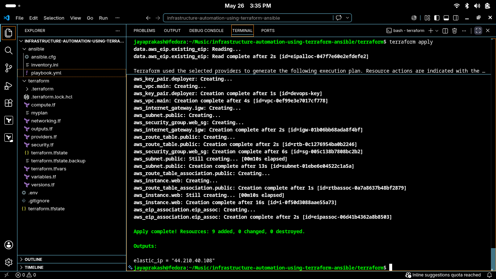

### Terraform Recreate — Same Elastic IP Re-Attached (`9 added`)

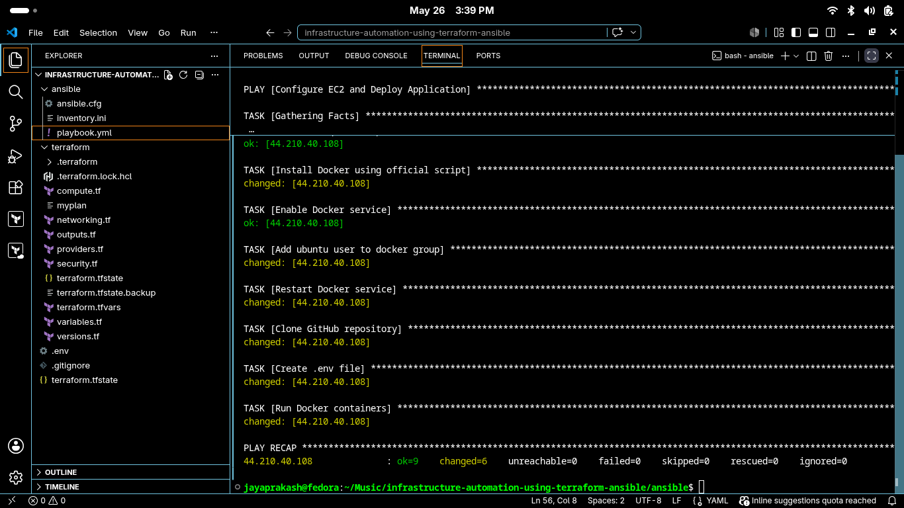

### Ansible Final Playbook Recap — `ok=9 changed=6` on New EC2

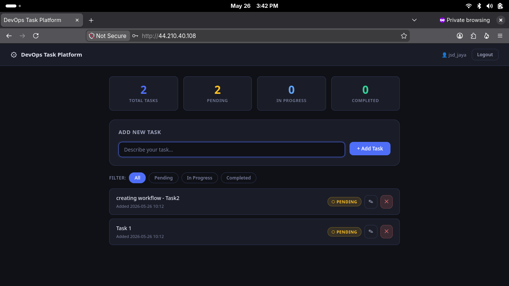

### Application Final — Live on New EC2 with Same IP

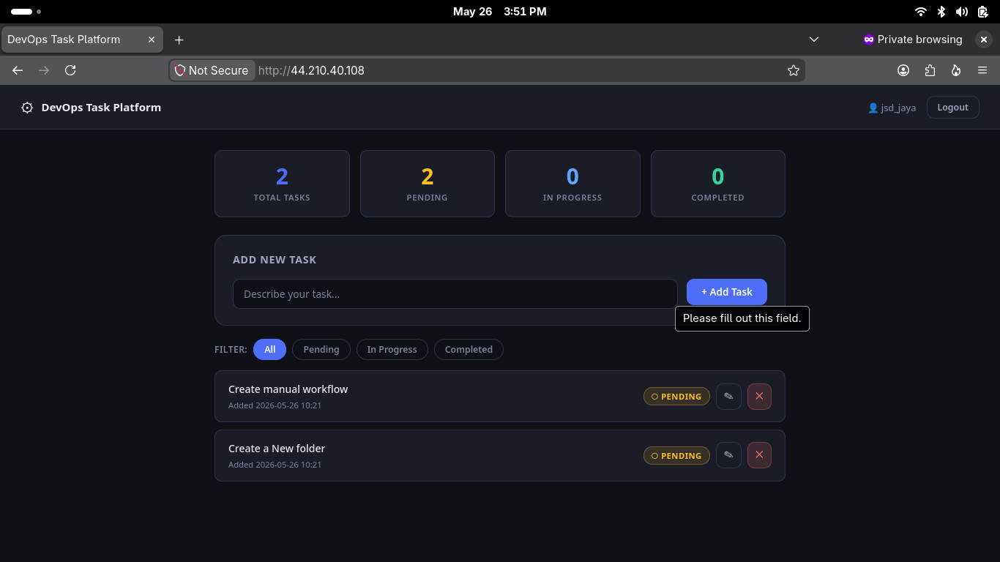

---

## 🐳 Application Services (Docker Compose)

The deployment runs six containerised services managed by Docker Compose:

| Service | Description |
|---|---|
| **Nginx** | Reverse proxy — routes HTTP traffic to the frontend and backend |
| **React Frontend** | Single-page application served as static assets |
| **Python/Gunicorn Backend** | REST API server handling business logic |
| **MySQL** | Relational database storing task and user data |
| **DB Init** | One-time container that seeds the database schema on first run |

---

## 🔄 Full Automation Workflow Summary

```
terraform apply
      ↓
EC2 Instance Created (VPC · Subnet · Security Groups · Route Table)
      ↓
Elastic IP Attached → SSH Access Ready
      ↓
ansible-playbook playbook.yml
      ↓
Docker Installed → Repository Cloned → .env Generated → Containers Started
      ↓
✅ Application Live at http://<ELASTIC_IP>
```

---

## ✅ Final Results

| Objective | Status |
|---|---|
| Infrastructure provisioned automatically via Terraform | ✅ Complete |
| Application deployed automatically via Ansible | ✅ Complete |
| Docker containers running (Nginx · Backend · MySQL · Frontend) | ✅ Complete |
| Elastic IP retained across destroy/recreate cycles | ✅ Complete |
| Infrastructure fully reproducible from scratch | ✅ Complete |
| End-to-end DevOps automation achieved | ✅ Complete |

---

## 🔒 Sensitive Files — Do Not Commit

Never commit the following files to version control:

| File | Reason |
|---|---|
| `.env` | Contains database passwords and secrets |
| `terraform.tfstate` / `terraform.tfstate.backup` | Contains sensitive infrastructure state and may include secrets |
| `~/.ssh/id_rsa` (private key) | Grants SSH access to your EC2 instance |
| `terraform.tfvars` | May contain environment-specific or sensitive configuration values |

Add these to your `.gitignore`:

```
# Terraform
.terraform/
*.tfstate
*.tfstate.*
terraform.tfvars

# Environment secrets
.env

# SSH keys
*.pem
*.key
```

---

## 🧠 Key Learnings

- Difference between Terraform (provisioning) and Ansible (configuration management)
- Building reproducible cloud infrastructure with IaC
- Elastic IP reusability for stable endpoints across infrastructure cycles
- Docker Compose multi-container orchestration on EC2
- Security Group design for web-facing applications
- VPC networking: subnets, internet gateways, and route tables
- Automated end-to-end deployment pipelines

---

## 🚀 Future Improvements

- [ ] Terraform Modules for reusable infrastructure components
- [ ] Remote Backend (S3 + DynamoDB state locking)
- [ ] Dynamic Ansible Inventory (auto-discovers EC2 IPs)
- [ ] GitHub Actions CI/CD pipeline integration
- [ ] HTTPS with Certbot / Let's Encrypt
- [ ] Monitoring stack (Prometheus + Grafana)
- [ ] Kubernetes deployment with EKS
- [ ] Custom domain name with Route 53

---

## 📂 Pushing to GitHub

When pushing this project, make sure to include the `screenshots/` folder alongside the README so GitHub can render all images correctly:

```bash
git add README.md screenshots/ terraform/ ansible/ .gitignore
git commit -m "Add infrastructure automation project with screenshots"
git push origin main
```

---

## 👨‍💻 Author

**Jaya Prakash**

- GitHub: [github.com/au422621106016](https://github.com/au422621106016)
- LinkedIn: [linkedin.com/in/jaya-prakash-s-1ba6442bb](https://linkedin.com/in/jaya-prakash-s-1ba6442bb)

---

*Built with Terraform · Ansible · AWS · Docker*
